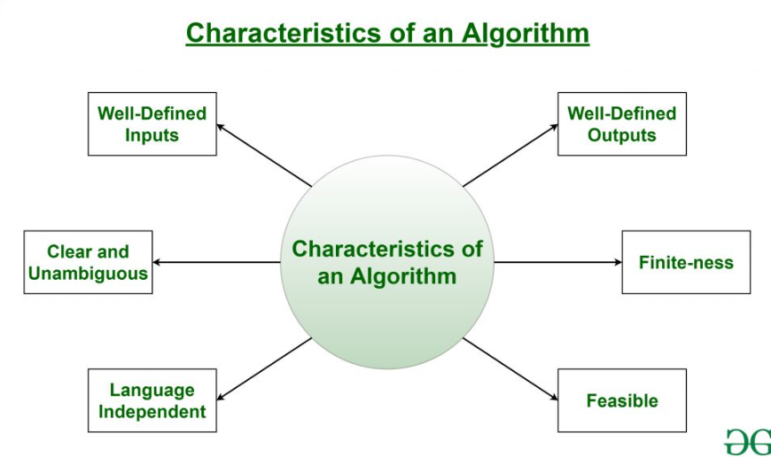

# Algorithms



links to review:

https://www.geeksforgeeks.org/algorithms-design-techniques/

## A. Searching
### 1. Binary Search 
(Iterative)
```java
int binarySearch(int arr[], int x)
    {
        int low = 0, high = arr.length - 1;
        while (low <= high) {
            int mid = low + (high - low) / 2;
            if (arr[mid] == x)
                return mid;
            if (arr[mid] < x)
                low = mid + 1;
            else
                high = mid - 1;
        }
        return -1;
    }
```
(Recursive)
```java 
int binarySearch(int arr[], int low, int high, int x){
    if (high >= low) {
        int mid = low + (high - low) / 2;
        if (arr[mid] == x)
            return mid;
        if (arr[mid] > x)
            return binarySearch(arr, low, mid - 1, x);
        return binarySearch(arr, mid + 1, high, x);
    }
    return -1;
}
```
### 2. Ternary Search 
(Recursive)
```java
static int ternarySearch(int l, int r, int key, int ar[]){
    if (r >= l) {
        int mid1 = l + (r - l) / 3;
        int mid2 = r - (r - l) / 3;
        if (ar[mid1] == key)
            return mid1;
        if (ar[mid2] == key)
            return mid2;
        if (key < ar[mid1])
            return ternarySearch(l, mid1 - 1, key, ar);
        else if (key > ar[mid2])
            return ternarySearch(mid2 + 1, r, key, ar);
        else
            return ternarySearch(mid1 + 1, mid2 - 1, key, ar);
    }
    return -1;
}
```
### 3. Interpolation Search 
(Array should be sorted) - (efficient if array uniformaly distributer)
```java
    public static int interpolationSearch(int arr[], int lo, int hi, int x){
    int pos;
    if (lo <= hi && x >= arr[lo] && x <= arr[hi]) {
        pos = lo + (((hi - lo) / (arr[hi] - arr[lo]))* (x - arr[lo]));
        // the way we partition is only difference to the binary search.
        //pos = low + ((indexDiff/valueDiff)*(diff of low from search value))
        if (arr[pos] == x)
            return pos;
        if (arr[pos] < x)
            return interpolationSearch(arr, pos + 1, hi, x);
        if (arr[pos] > x)
            return interpolationSearch(arr, lo, pos - 1, x);
    }
    return -1;
}
```
### 
```java
```
### 
```java
```
### 
```java
```
### 
```java
```
### 
```java
```
### 
```java
```
### 
```java
```
### 
```java
```
## B. Sorting 
### 0. Swap two indices
```java
    static void swap(int[] arr, int a, int b) {
        int temp = arr[a];
        arr[a] = arr[b];
        arr[b] = temp;
    }
```
### 1. Bubble Sort
```java
class Sort {
    static void bubbleSort(int[] arr) {
        for (int i = 0; i < arr.length; i++)
            for (int j = 0; j < arr.length - i - 1; j++) {
                if (arr[j] > arr[j + 1]) {
                    arr[j] = arr[j] + arr[j + 1];
                    arr[j + 1] = arr[j] - arr[j + 1];
                    arr[j] = arr[j] - arr[j + 1];
                }
            }
        System.out.print("bubble: ");
        for (int i : arr) System.out.print(i + " ");
        System.out.println();
    }
```
### 2. Selection Sort
```java

    static void selectionSort(int[] arr) {
        for (int i = 0; i < arr.length; i++) {
            int minIndex = i;
            for (int j = i + 1; j < arr.length; j++)
                if (arr[j] < arr[minIndex])
                    minIndex = j;
            if (minIndex != i) {
                arr[minIndex] = arr[minIndex] + arr[i];       // this way of swaping doesn't work if trying to swap on the same index
                arr[i] = arr[minIndex] - arr[i];
                arr[minIndex] = arr[minIndex] - arr[i];
            }
        }
        System.out.print("selection: ");
        for (int i : arr) System.out.print(i + " ");
        System.out.println();
    }
```
### 3. Insertion Sort
```java
    static void insertionSort(int[] arr) {
        for (int i = 1; i < arr.length; i++) {
            int key = arr[i];
            int j = i - 1;
            while (j >= 0 && arr[j] > key) {
                arr[j + 1] = arr[j];
                j--;
            }
            arr[j + 1] = key;
        }
        System.out.print("insertion: ");
        for (int i : arr) System.out.print(i + " ");
        System.out.println();
    }
```
### 4. Merge Sort
```java
    static void mergeSortedArray(int[] arr, int l, int m, int r) {
        int n1 = m - l + 1;
        int n2 = r - m;

        int[] larr = new int[n1];
        int[] rarr = new int[n2];

        for (int i = 0; i < n1; i++) larr[i] = arr[i + l];
        for (int i = 0; i < n2; i++) rarr[i] = arr[i + m + 1];

        int i = 0;
        int j = 0;
        while (i < n1 && j < n2) {
            if (larr[i] < rarr[j]) {
                arr[l] = larr[i];
                i++;
            } else {
                arr[l] = rarr[j];
                j++;
            }
            l++;
        }
        while (i < n1) {
            arr[l] = larr[i];
            i++;
            l++;
        }

        while (j < n2) {
            arr[l] = rarr[j];
            j++;
            l++;
        }
    }

    static void mSort(int[] arr, int l, int r) {
        if (l < r) {
            int m = l + (r - l) / 2;
            mSort(arr, l, m);
            mSort(arr, m + 1, r);
            mergeSortedArray(arr, l, m, r);
        }
    }

    static void mergeSort(int[] arr) {
        mSort(arr, 0, arr.length - 1);
        System.out.print("merge: ");
        for (int i : arr) System.out.print(i + " ");
        System.out.println();
    }
```
### 5. Quick Sort
```java

    static int qPartition(int[] arr, int low, int high) {
        int pivot = arr[high];
        int k = low;
        for (int i = low; i <= high; i++) {
            if (arr[i] < pivot) {
                swap(arr, k, i);
                k++;
            }
        }
        swap(arr, k, high);
        return k;
    }

    static void qSort(int[] arr, int low, int high) {
        if (low < high) {
            int pi = qPartition(arr, low, high);
            qSort(arr, low, pi - 1);
            qSort(arr, pi + 1, high);
        }
    }

    static void quickSort(int[] arr) {
        qSort(arr, 0, arr.length - 1);
        System.out.print("quick: ");
        for (int i : arr) System.out.print(i + " ");
        System.out.println();
    }
}
class Sorting {
    public static void main(String[] args) {
        int[] arr = new int[]{1, 2, 3, 4, 3, 2, 56, 7, 5, 4, 7, 8, 7, 5, 6, 7, 8, 9, 4, 32, 7, 0, 0, 0};
        for (int i : arr) System.out.print(i + " ");
        System.out.println();
        Sort.bubbleSort(arr.clone());
        Sort.selectionSort(arr.clone());
        Sort.insertionSort(arr.clone());
        Sort.mergeSort(arr.clone());
        Sort.quickSort(arr.clone());

    }
}
```
## E. Basic math functions
```java
public class MathOperations {
    
    // Method to find the factorial of a number
    public static long factorial(int n) {
        if (n == 0 || n == 1) {
            return 1;
        } else {
            return n * factorial(n - 1);
        }
    }
    
    // Method to check if a number is prime
    public static boolean isPrime(int n) {
        if (n <= 1) {
            return false;
        }
        for (int i = 2; i <= Math.sqrt(n); i++) {
            if (n % i == 0) {
                return false;
            }
        }
        return true;
    }
    
    // Method to calculate the nth Fibonacci number
    public static int fibonacci(int n) {
        if (n <= 1) {
            return n;
        }
        int a = 0, b = 1;
        for (int i = 2; i <= n; i++) {
            int temp = b;
            b = a + b;
            a = temp;
        }
        return b;
    }
    
    // Method to calculate the greatest common divisor (GCD) of two numbers
    public static int gcd(int a, int b) {
        if (b == 0) {
            return a;
        }
        return gcd(b, a % b);
    }
    
    // Method to calculate the least common multiple (LCM) of two numbers
    public static int lcm(int a, int b) {
        return (a * b) / gcd(a, b);
    }
    
    // Method to calculate the square root using Newton's method
    public static double sqrt(double x) {
        if (x < 0) {
            throw new IllegalArgumentException("Cannot calculate square root of a negative number");
        }
        double guess = x / 2;
        while (Math.abs(guess * guess - x) > 0.0001) {
            guess = (guess + x / guess) / 2;
        }
        return guess;
    }
    
    // Method to calculate the power of a number
    public static double power(double base, int exponent) {
        double result = 1;
        for (int i = 0; i < Math.abs(exponent); i++) {
            result *= base;
        }
        if (exponent < 0) {
            return 1 / result;
        } else {
            return result;
        }
    }
    
    // Method to calculate the absolute value of a number
    public static int abs(int n) {
        return (n < 0) ? -n : n;
    }
    
    // Method to calculate the square of a number
    public static int square(int n) {
        return n * n;
    }
    
    // Method to calculate the cube of a number
    public static int cube(int n) {
        return n * n * n;
    }
    
    // Method to calculate the average of an array of numbers
    public static double average(int[] numbers) {
        int sum = 0;
        for (int num : numbers) {
            sum += num;
        }
        return (double) sum / numbers.length;
    }
}

```
### 
```java
```
### 
```java
```
### 
```java
```
### 
```java
```
### 
```java
```
### 
```java
```
### 
```java
```
### 
```java
```
### 
```java
```
### 
```java
```
### 
```java
```
### 
```java
```
### 
```java
```
### 
```java
```
### 
```java
```
### 
```java
```
### 
```java
```
### 
```java
```
### 
```java
```
### 
```java
```
### 
```java
```
### 
```java
```
### 
```java
```
### 
```java
```
### 
```java
```
### 
```java
```
### 
```java
```
### 
```java
```
### 
```java
```
### 
```java
```
### 
```java
```
### 
```java
```
### 
```java
```
### 
```java
```
### 
```java
```
### 
```java
```
### 
```java
```
### 
```java
```
### 
```java
```
### 
```java
```
### 
```java
```
### 
```java
```
### 
```java
```
### 
```java
```
### 
```java
```
### 
```java
```
### 
```java
```
### 
```java
```
### 
```java
```
### 
```java
```
### 
```java
```
### 
```java
```
### 
```java
```
### 
```java
```
### 
```java
```
### 
```java
```
### 
```java
```
### 
```java
```
### 
```java
```
### 
```java
```
### 
```java
```
### 
```java
```
### 
```java
```
### 
```java
```
### 
```java
```
### 
```java
```
### 
```java
```
### 
```java
```
### 
```java
```
### 
```java
```
### 
```java
```
### 
```java
```
### 
```java
```
### 
```java
```
### 
```java
```
### 
```java
```
### 
```java
```
### 
```java
```
### 
```java
```
### 
```java
```
### 
```java
```
### 
```java
```
### 
```java
```
### 
```java
```
### 
```java
```
### 
```java
```
### 
```java
```
### 
```java
```
### 
```java
```
### 
```java
```
### 
```java
```
### 
```java
```
### 
```java
```
### 
```java
```
### 
```java
```
### 
```java
```
### 
```java
```
### 
```java
```
### 
```java
```
### 
```java
```
### 
```java
```
### 
```java
```
### 
```java
```
### 
```java
```
### 
```java
```


