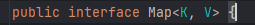

# Java collections

0. interface Iterable

1. interface Collection

2. interface Set

3. interface List

4. interface Queue

5. class HashSet

6. class LinkedHashSet

7. class ArrayList

8. class Vector

9. class Stack

10. class LinkedList

11. interface Deque

12. interface SortedSet

13. class TreeSet

14. class PriorityQueue

15. class ArrayDeque

16. interface Map

17. abstract class AbstractMap

18. class HashMap

19. class EnumMap

20. interface SortedMap

21. interface NavigableMap

22. class TreeMap

todo 1: Look into (CLoneable interface, java.io.serializable interface, RandomAccess)

## Methods of the Collection Interface
- add(Object) : This method is used to add an object to the collection.
- addAll(Collection c) :  This method adds all the elements in the given collection to this collection.
- clear() : This method removes all of the elements from this collection.
- contains(Object o) : This method returns true if the collection contains the specified element.
- containsAll(Collection c) : This method returns true if the collection contains all of the elements in the given collection.
- equals(Object o) : equals(Object o)
- hashCode() : This method is used to return the hash code value for this collection.
- isEmpty() : This method returns true if this collection contains no elements.
- iterator() : This method returns an iterator over the elements in this collection.
- max() : This method is used to return the maximum value present in the collection.
- parallelStream() : This method returns a parallel Stream with this collection as its source.
- remove(Object o) : This method is used to remove the given object from the collection. If there are duplicate values, then this method removes the first occurrence of the object.
- removeIf(Predicate filter) : This method is used to remove all the elements of this collection that satisfy the given predicate.
- retainAll(Collection c) :T his method is used to retain only the elements in this collection that are contained in the specified collection.
- size() : This method is used to return the number of elements in the collection.
- spliterator() : This method is used to create a Spliterator over the elements in this collection.
- stream() : This method is used to return a sequential Stream with this collection as its source.
- toArray() : This method is used to return an array containing all of the elements in this collection.

## Methods expicit to the Set Interface

